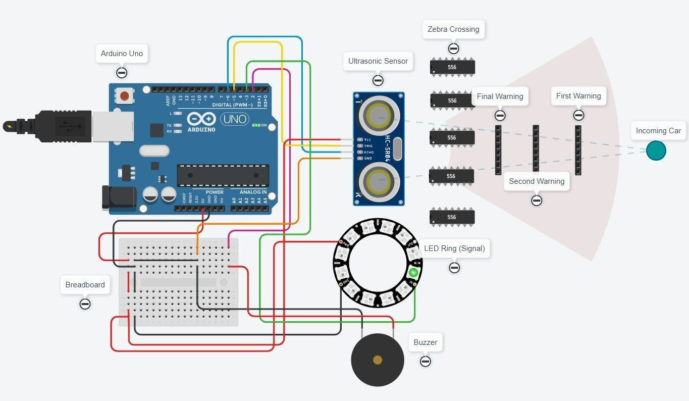

# Zebra Crossing Vehicle Alert System


An Arduino prototype that uses an ultrasonic sensor and a NeoPixel LED strip to alert when a vehicle enters a zebra crossing detection zone. Designed to address the common traffic violation of vehicles stopping on pedestrian crossings.

## Table of Contents

- [Features](#features)
- [Tech Stack](#tech-stack)
- [How It Works](#how-it-works)
- [Hardware & Wiring](#hardware--wiring)
- [Prerequisites](#prerequisites)
- [Usage](#usage)
- [Project Structure](#project-structure)
- [Limitations](#limitations)
- [License](#license)

## Features

- Proximity-based detection using an HC-SR04 ultrasonic sensor
- 12-pixel NeoPixel LED strip with colour-coded proximity zones (green → yellow → red)
- Buzzer alert triggered when a vehicle is within the closest detection threshold
- Configurable detection range via `minDistance` and `maxDistance` constants
- Tinkercad simulation for virtual testing


## Tech Stack

- Arduino (C++)
- [Adafruit NeoPixel](https://github.com/adafruit/Adafruit_NeoPixel) library
- HC-SR04 ultrasonic sensor
- 12-pixel NeoPixel RGB LED strip
- Passive buzzer


## How It Works

1. The HC-SR04 ultrasonic sensor emits a pulse and measures the echo return time to calculate distance.
2. The measured distance is mapped to a number of LEDs to illuminate (12 LEDs = closest, 1 LED = farthest).
3. LEDs are colour-coded by proximity zone:
   - **Green** (LEDs 0–3): vehicle is far from the line
   - **Yellow** (LEDs 4–7): vehicle is approaching
   - **Red** (LEDs 8–11): vehicle is near the line
4. When all 12 LEDs are active (distance ≤ `minDistance`), the buzzer fires.


## Hardware & Wiring

| Component | Arduino Pin |
|-----------|-------------|
| Ultrasonic sensor — Trig | Pin 5 |
| Ultrasonic sensor — Echo | Pin 6 |
| NeoPixel strip — Data | Pin 3 |
| Buzzer | Pin 2 |

See `circuit.jpg` for the full labelled circuit diagram.




## Prerequisites

- [Arduino IDE](https://www.arduino.cc/en/software)
- **Adafruit NeoPixel** library — install via Arduino IDE Library Manager (`Sketch → Include Library → Manage Libraries → search "Adafruit NeoPixel"`)


## Usage

1. Clone the repository:
   ```bash
   git clone https://github.com/archiskhuspe/zebra-crossing-vehicle-alert-system.git
   ```
2. Open `zebra_crossing_alert.ino` in the Arduino IDE.
3. Install the Adafruit NeoPixel library (see Prerequisites).
4. Adjust `minDistance` and `maxDistance` in the sketch to match your physical setup (values are in mm).
5. Upload to an Arduino board, or open the Tinkercad simulation to test virtually:
   [https://www.tinkercad.com/things/fF0M4apSDoQ](https://www.tinkercad.com/things/fF0M4apSDoQ)


## Project Structure

```
zebra-crossing-vehicle-alert-system/
├── zebra_crossing_alert.ino   # Arduino sketch
├── circuit.jpg                # Labelled circuit diagram
├── research_paper.pdf         # Detailed project documentation
├── LICENSE
└── README.md
```


## Limitations

- **No traffic light integration** — the buzzer activates on proximity alone; the sketch does not read traffic signal state. Real deployment would require an additional sensor or signal interface to restrict alerts to red-light phases.
- **Fixed speed-of-sound** — distance calculation uses the approximation `duration / 29 / 2` (≈ 340 m/s at 20 °C); accuracy degrades at higher temperatures or humidity.
- **Simulation-scale constants** — `minDistance` (100 mm) and `maxDistance` (300 mm) are calibrated for the Tinkercad simulation; a real-world crosswalk installation would require recalibration.
- **Prototype only** — not tested on physical hardware or in a real traffic environment.


## License

Released under the [MIT License](LICENSE).
